## Starcheap
### Développement gameplay et game design

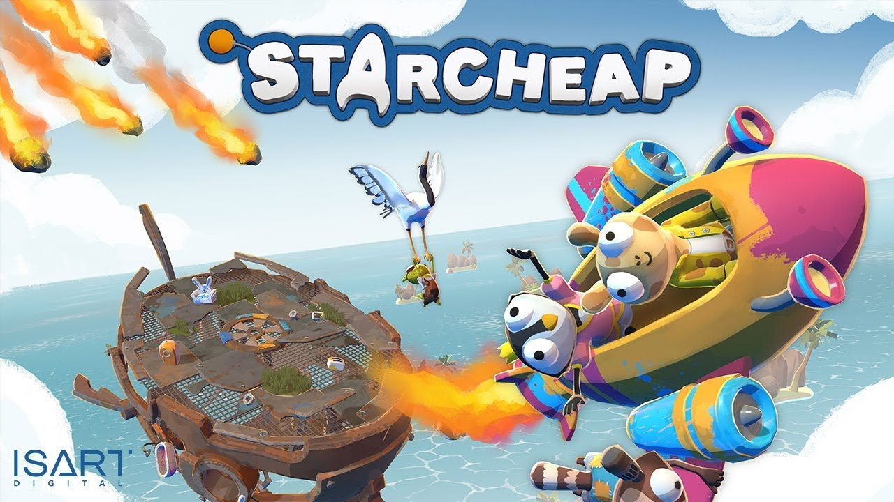

Starcheap est un jeu type *party-game* en co-op local sur PC jouable à 4 joueurs.
Il a été réalisé durant mon projet de fin d'étude à [Isart Digital](https://www.isart.fr/), au sein d'une équipe de 5 personnes composée de deux Game Artists, deux Game Programmers et un Producer.

Votre base s'écroule, vous n’avez que quelques minutes pour vous échapper avant sa destruction !
Coopérez et utilisez les ressources autour de vous intelligemment afin de construire un vaisseau afin de vous enfuire.
Des événements météorologiques viendront déstabiliser l’équilibre de la plateforme sur laquelle vous êtes, tout en vous apportant de précieuses ressources.

Pour réaliser le jeu, le moteur [Unity](https://unity.com/) a été utilisé avec une intégration de [FMOD](https://www.fmod.com/).
Au cours du développement, j'ai dans un premier temps participé au game design, plus particulièrement aux différentes épreuves auxquelles les joueurs allaient être confronté comme l'équilibre de la plateforme sur laquelle les joueurs se trouvent ou encore les différents événements météorologiques. J'ai ensuite créé des prototypes afin de valider ces idées au sein du groupe.
Dans un second temps, je me suis concentré sur le développement gameplay des features validées, de l'intégration des éléments graphiques, des animations, de la musique et des sons en jeu.

[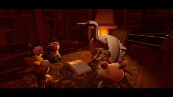](assets/images/Screen4StarcheapLarge.png) [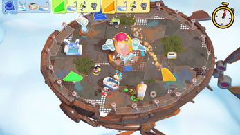](assets/images/Screen1StarcheapLarge.png) [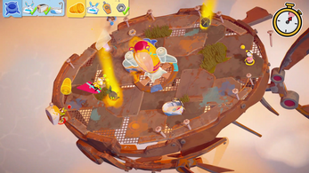](assets/images/Screen2StarcheapLarge.png) [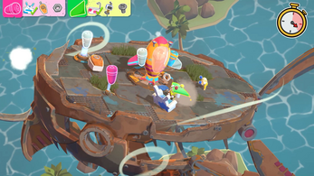](assets/images/Screen3StarcheapLarge.png)

[Disponible sur itch.io](https://isart-digital.itch.io/starcheap){:target="_blank"}

* * *

## Simulation d'océan
### Reverse engineering

Ce projet a été réalisé durant mon année de spécialisation Recherche & Développement à [Isart Digital](https://www.isart.fr/) avec un autre programmeur.
L'objectif était de choisir un jeu, d'en étudier l'une de ces features principales et de la reproduire.
Comme sujet, nous avons choisi l'océan du jeu *Sea of Thieves*.

Il nous a fallu réaliser un "état de l'art" afin de connaître les techniques existantes et possibles pour simuler un océan.
Après avoir exploré les différentes solutions, nous en avons conclu que la technique utilisant la [transformation de Fourier](https://fr.wikipedia.org/wiki/Transformation_de_Fourier) était la plus appropriée.
Nous avons donc créé un prototype sous [Unity](https://unity.com/) avec un premier modèle exploitant la transformation de Fourier [rapide](https://fr.wikipedia.org/wiki/Transformation_de_Fourier_rapide) et [discrète](https://fr.wikipedia.org/wiki/Transformation_de_Fourier_discr%C3%A8te).
Notre but final était d'avoir un premier rendu d'océan fonctionnel et paramétrable avec lequel il est possible d'intéragir pour rajouter une notion de gameplay.

[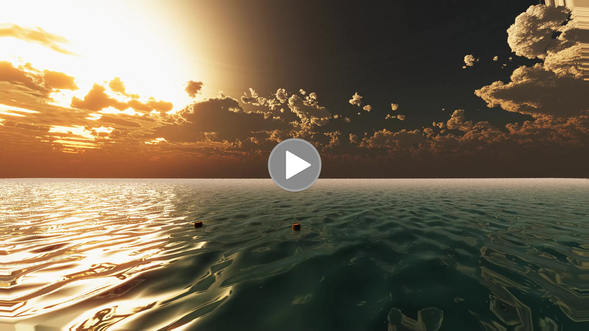](assets/videos/OceanSimulation.mp4) [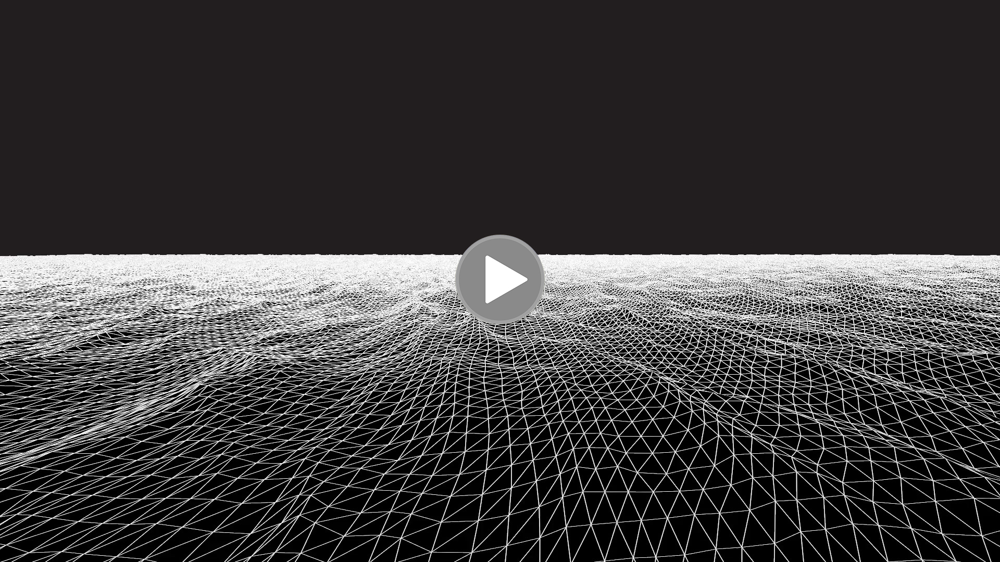](assets/videos/OceanSimulationWireframe.mp4)

* * *

## Beat them up
### Développement gameplay

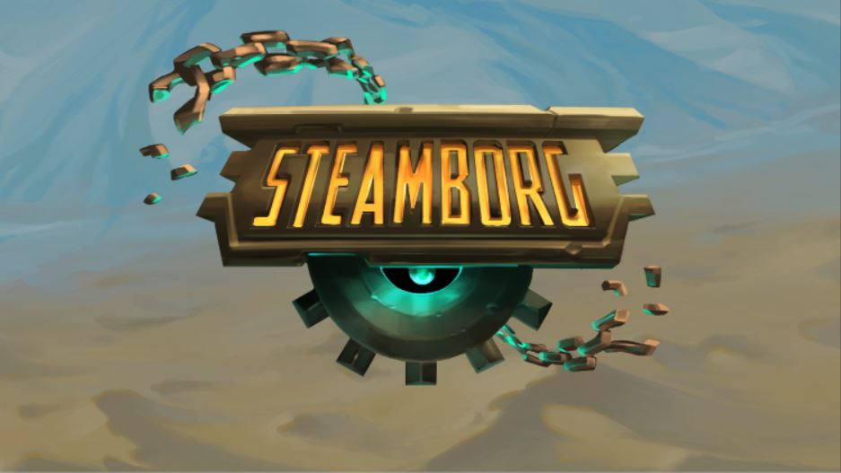

Steamborg est un jeu type *beat them up* sur PC jouable à 1 ou 2 joueurs.
Il s'agit de mon projet de fin de troisième année à [Isart Digital](https://www.isart.fr/), réalisé dans une équipe de 9 personnes, deux Game Artists, trois Game Designers, trois Game Programmers et un Sound Designer.

*Vidéo*

Le jeu a été réalisé sur [Unity](https://unity.com/) avec [FMOD](https://www.fmod.com/) pour le son et [Anima2D](https://assetstore.unity.com/packages/essentials/unity-anima2d-79840) pour les animations.
En collaboration avec les Game Designers, j'ai développé toute la partie gameplay des personnages jouables et les intelligences artificielles. Je me suis également occupé de l'intégration des animations et de l'interface utilisateur.

[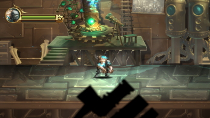](assets/images/Screen1SteamborgLarge.png) [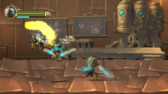](assets/images/Screen3SteamborgLarge.png) [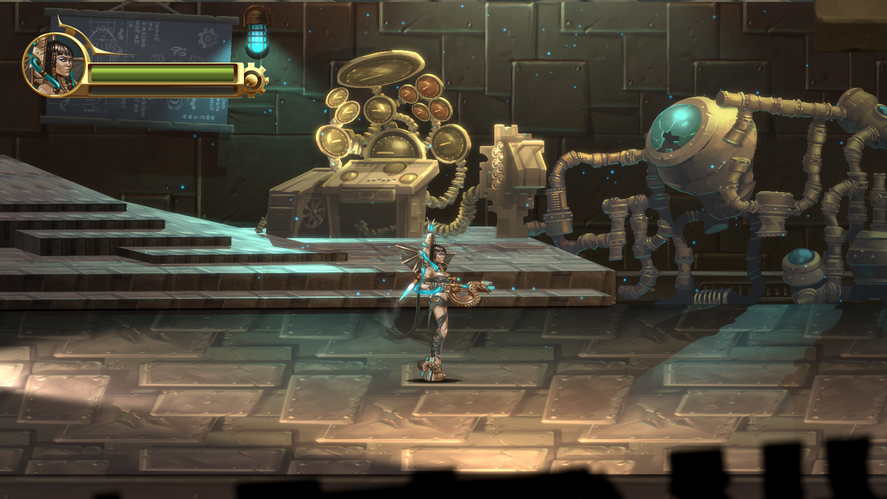](assets/images/Screen2SteamborgLarge.png) [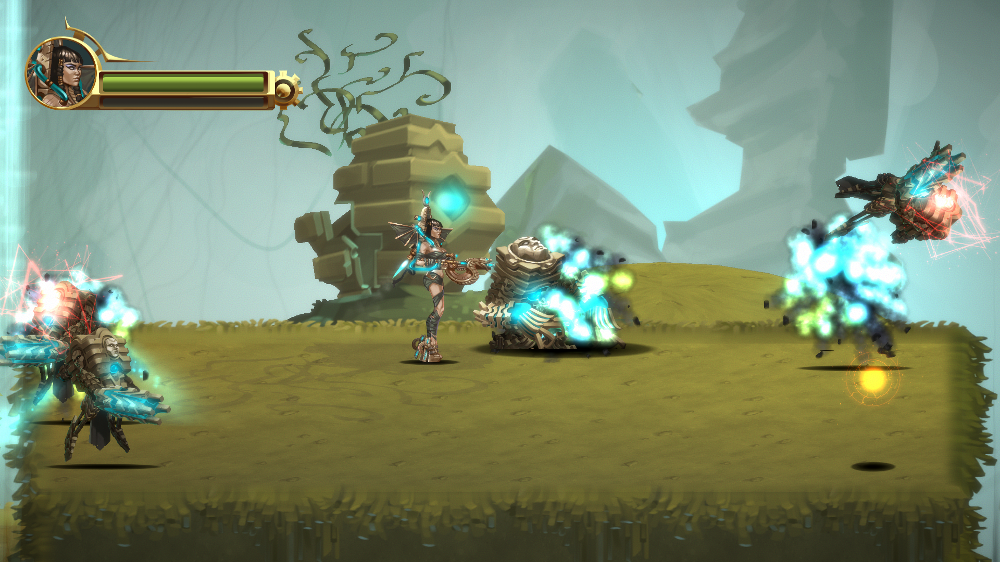](assets/images/Screen4SteamborgLarge.png)

* * *

## Machine learning
### Reconnaissance de chiffres écrits à la main

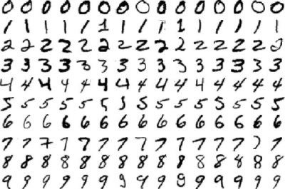

Le sujet du [Machine learning](https://fr.wikipedia.org/wiki/Apprentissage_automatique) et du [Deep learning](https://fr.wikipedia.org/wiki/Apprentissage_profond) m'ont toujours beaucoup intéressé, je me suis donc lancé dans ce petit projet sur mon temps libre. Le but était de créer un modèle capable de reconnaître des chiffres écrits à la main. Le projet est entièrement codé en C++ et utilise [Qt](https://www.qt.io/).
Pour pouvoir entraîner mon modèle, je devais disposer d'un grand nombre de chiffres. Je me suis servi d'une [base de données](http://yann.lecun.com/exdb/mnist/) couramment utilisé pour ce genre de projet.
Il est possible de créer un nouveau modèle et de l'enregistrer dans un fichier binaire. On peut ensuite utiliser le modèle qui vient d'être créé ou en charger un et lui présenter des chiffres à deviner.

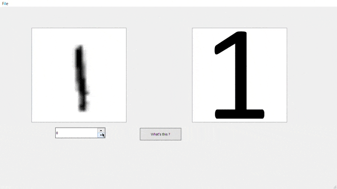
